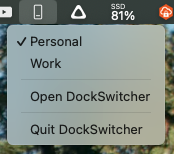
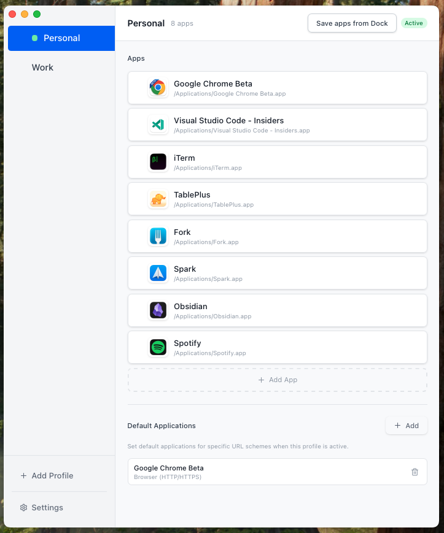

# DockSwitcher

[](https://github.com/rodvilla/dockswitcher/actions/workflows/release.yml)
[](https://github.com/rodvilla/dockswitcher/releases/latest)
[](LICENSE)

**macOS menu bar app to create and switch between Dock profiles.**

DockSwitcher lets you define multiple Dock configurations for different contexts—work, personal, development, etc.—and switch between them instantly from the menu bar. Each profile can include its own set of Dock applications and default URL scheme handlers (browser, email client, etc.).

## Screenshots

<table>
  <tr>
    <td><strong>Menu Bar Quick Switch</strong></td>
    <td><strong>Profile Management</strong></td>
  </tr>
  <tr>
    <td></td>
    <td></td>
  </tr>
</table>

## Features

- **Multiple Dock Profiles**: Create and save different Dock configurations for various workflows
- **Quick Menu Bar Switching**: Change profiles instantly from the macOS menu bar without opening the app
- **Default Applications per Profile**: Automatically set your preferred browser, email client, FTP handler, or calendar app when a profile is activated
- **Drag & Drop App Management**: Reorder apps within a profile with sortable drag-and-drop
- **Live Dock Capture**: Save your current Dock apps directly into any profile

## Building from source

### Prerequisites

- macOS 14+
- [Node.js](https://nodejs.org/) (LTS)
- [Rust](https://rustup.rs/)
- Tauri CLI v2: `cargo install tauri-cli`

### Clone and install

```bash
git clone https://github.com/rodvilla/dockswitcher.git
cd dockswitcher
yarn install
```

### Development

Run the full desktop app with live reload:

```bash
yarn run tauri dev
```

If you only want the frontend dev server:

```bash
yarn run dev
```

### Testing

```bash
yarn test
```

```bash
cargo test
```

### Build (production)

```bash
yarn run tauri build
```

Build artifacts are generated at:

```
src-tauri/target/release/bundle/
```

This includes a `.dmg` installer and `.app` bundle.

### Preview the production frontend

```bash
yarn run build
yarn run preview
```

## Recommended IDE Setup

- [VS Code](https://code.visualstudio.com/) + [Tauri](https://marketplace.visualstudio.com/items?itemName=tauri-apps.tauri-vscode) + [rust-analyzer](https://marketplace.visualstudio.com/items?itemName=rust-lang.rust-analyzer)
